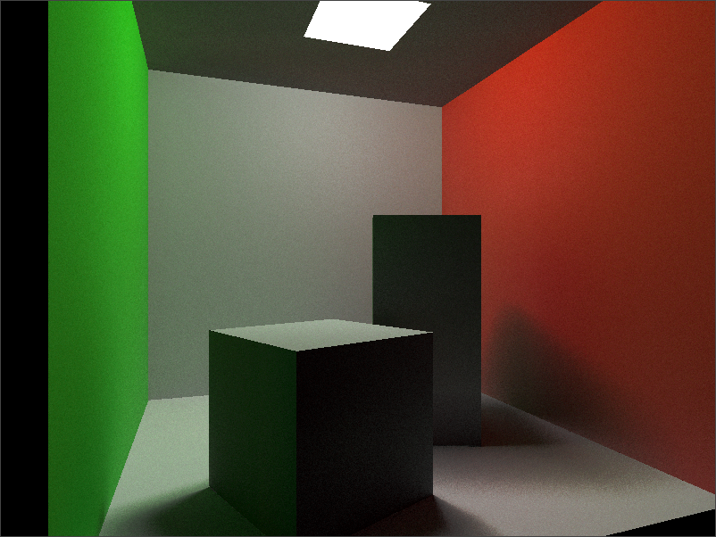
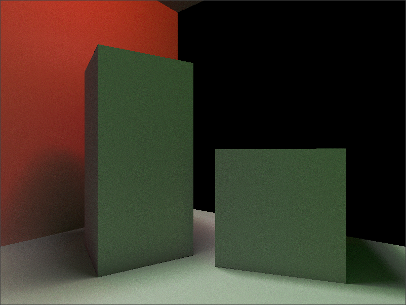
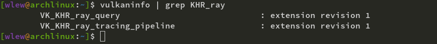

# Vulkan Ray Tracing Minimal Abstraction

<p float="left">
  
  
</p>

**ray_pipeline** uses the ray tracing pipeline to generate the final image.

**ray_query** uses the graphics pipeline along with ray querying to generate the final image.

## Important Note

Make sure the **VK_KHR_ray_query** and  **VK_KHR_ray_tracing_pipeline** extensions are available on your device!

**Even if you have a compatible RTX / RX graphics card, your drivers may not have the extension available.**

To see if the extension is available, you can use the **vulkaninfo** binary.



### Build Steps

Navigate to a subproject:
```bash
cd vulkan_ray_tracing_minimal_abstraction/ray_pipeline
# or cd vulkan_ray_tracing_minimal_abstraction/ray_query
```

Create a build directory and navigate to the new directory.
```bash
mkdir build
cd build
```
Run cmake with the root of the repository as the argument. You can now use the make file generated by CMake.
```bash
cmake ..
make
```
