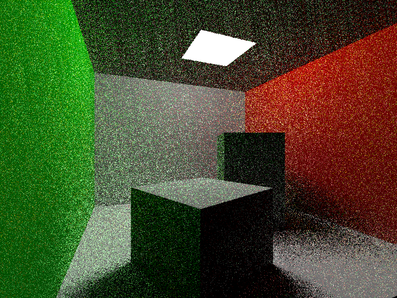

# Vulkan Ray Tracing with Minimal Abstraction

<p float="left">
  
  
</p>

**ray_pipeline** uses the ray tracing pipeline to render the final image.

**ray_query** uses the graphics pipeline along with ray querying to render the final image.

**headless** generates a ray traced image without creating a window or requiring a surface.

## Important Note

Make sure the **VK_KHR_ray_query** and  **VK_KHR_ray_tracing_pipeline** extensions are available on your device!

**Even if you have a compatible RTX / RX graphics card, your drivers may not have the extension available.**

To see if the extension is available, you can use the **vulkaninfo** binary.


## Dependencies

* Graphics drivers with Vulkan support (AMD, NVIDIA, MESA, etc...)
* [Vulkan SDK](https://vulkan.lunarg.com/home/welcome) or build each component individually:
  * [Vulkan Headers](https://github.com/KhronosGroup/Vulkan-Headers)
  * [Vulkan Loader](https://github.com/KhronosGroup/Vulkan-Loader)
  * [glslang](https://github.com/KhronosGroup/glslang)
  * [Vulkan Validation Layers](https://github.com/KhronosGroup/Vulkan-ValidationLayers) (if you want to enable validation layers)
* [CMake](https://cmake.org/)

### Windows

* [Visual Studio 2022](https://visualstudio.microsoft.com/vs/)

### Linux

* X11 (not required for headless example)
* GCC

## Building

Navigate to a subproject:
```bash
cd vulkan_ray_tracing_minimal_abstraction/ray_pipeline
# or
#   cd vulkan_ray_tracing_minimal_abstraction/ray_query
# or
#   cd vulkan_ray_tracing_minimal_abstraction/headless
```

Build on Linux or Windows through CMake:
```bash
mkdir build
cd build
cmake ..
# with validation layers enabled:
#   cmake .. -D VALIDATION_ENABLED=1

# on Linux
make

# on Windows:
#   cmake --build .
```

#### Image generated from headless example:

